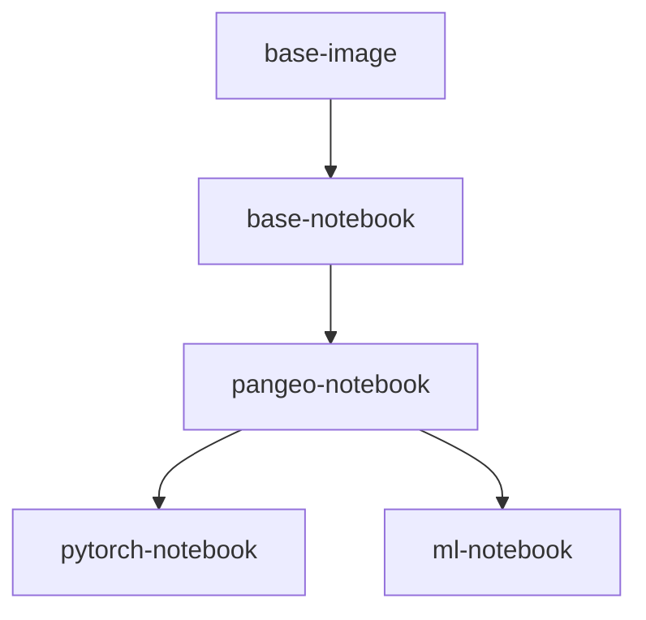

# PANGEO

   

> Anticloud-hardened packaging of the upstream project `PANGEO` in category **ACADEMIA RD**. Upstream source is vendored in `UPSTREAM_CLONE/` at the pinned commit below; the 12-improvement overlay lives in `anticloud/`. Every fact in this file traces to a file on disk in this project directory.

**Category:** ACADEMIA RD · **Upstream:** https://github.com/the-anticloud/anticloud-pangeo.git · **Upstream pin:** `92364799b4a45b876f8d5147f4e2e432ea56e4f4` · **Vendor:** Anticloud FZ LLE

---

## What This Project Does

# Pangeo Docker Images

[](https://pangeo-docker-images.readthedocs.org/en/latest/)


The images defined in this project capture reproducible computing environments used by [Pangeo Cloud](https://pangeo.io/cloud.html). They build on top of the Ubuntu operating system and include [conda environments](https://conda.io/projects/conda) with a curated set of Python packages for geospatial analysis. While initially intended for Pangeo Cloud, they can be used outside of Pangeo infrastructure too!

More details can be found in [our documentation](https://pangeo-docker-images.readthedocs.io).

Images are hosted on [DockerHub](https://hub.docker.com/u/pangeo) and on [Quay.io](https://quay.io/organization/pangeo)

| Image           | Description                                   |  Size | Pulls |
|-----------------|-----------------------------------------------|--------------|-------------|
| base-image      | Foundational Dockerfile for builds            |  | 
| [base-notebook](base-notebook/packages.txt) | minimally functional image for pangeo hubs |  | 
| [pangeo-notebook](pangeo-notebook/packages.txt) | base-notebook + core earth science analysis packages |  | 
| [pytorch-notebook](pytorch-notebook/packages.txt) | pangeo-notebook + GPU-enabled pytorch |  | 
| [ml-notebook](ml-notebook/packages.txt) | pangeo-notebook + GPU-enabled tensorflow2 |  | 

*Click on the image name in the table above for a current list of installed packages and versions*



### Using the image with Singularity on HPC systems

If you want to use this image on an HPC system (including a GPU system), we recommend using Singularity. Please see the [Singularity guide](Sing+GPU.md).

### Dask-gateway compatibility

The primary use of these Docker images is running on Pangeo Cloud deployments with [dask-gateway](https://github.com/dask/dask-gateway). Generally, the dask-gateway library version built into the image must match the dask-gateway version deployed in the cloud environment. The follow table keeps track of the first time a new dask-gateway version appears in a tagged image:

| dask-gateway |  Image tag  |
|--------------|-------------|
| 0.9          | 2020.11.06  |
| 0.8          | 2020.07.28  |
| 0.7          | 2020.04.22  |

### Other notes

* Since 2020.10.16, [mamba](https://github.com/mamba-org/mamba) is installed into the base-image and conda-lock environment and is used by default to solve for a compatible environment (see #146)
* For a simple list of packages for a given image, you can use a link like this: https://github.com/pangeo-data/pangeo-docker-images/blob/2020.10.08/pangeo-notebook/packages.txt
* To compare changes between two images, you can use a link like this: https://github.com/pangeo-data/pangeo-docker-images/compare/2020.10.03..2020.10.08
* As of 2024.05.21, the `ml-notebook` and `pytorch-notebook` docker images contain
  machine learning libraries built with CUDA 12. In previous versions, we have suggested
  `ml-notebook` users to install `cuda-nvcc` manually to obtain JAX and/or TensorFlow
  with [XLA](https://openxla.org/xla) optimization, but this workaround should no longer
  be needed if you are using `ml-notebook` 2024.06.02 or newer that comes with
  `cuda-nvcc` pre-installed.
* There used to be a `pangeo/forge` image, built for use with [pangeo-forge](https://pangeo-forge.org/). It is
  no longer actively maintained or used, but you can still use the [historical tags](https://quay.io/project/pangeo/forge?tab=tags)
  if you wish.
* Note that users of zarr-python are advised to avoid using image tags `2025.01.10`
  and `2025.01.24` due to a bug in `zarr-python>=3.0.0,<=3.0.7` that may result in
  potential data loss, see more details in
  https://github.com/pangeo-data/pangeo-docker-images/issues/606
* Since `2025.07.31`, the docker images are using Ubuntu-24.04 (Noble Numbat) instead of
  Ubuntu 22.04 (Jammy Jellyfish) as the base image.

*Quoted from the upstream `README.md` file in `UPSTREAM_CLONE/`.*
Project-specific facts detected in this directory:

- Ecosystem: **C/C++ / Make** (manifests: Makefile; scanned in UPSTREAM_CLONE)
- Top-level source layout: `base-image/`, `base-notebook/`, `ml-notebook/`, `pangeo-notebook/`, `pytorch-notebook/`, `tests/`
- Snapshot size: **59 files**, **318 lines of code** (measured; see Benchmarks)
- Primary languages: `(none)` (13), `.yml` (11), `.py` (10), `.md` (9), `.txt` (8), `.lock` (4)
- Upstream commit pinned for this packaging: `92364799b4a45b876f8d5147f4e2e432ea56e4f4`

---

## Installation


The images defined in this project capture reproducible computing environments used by [Pangeo Cloud](https://pangeo.io/cloud.html). They build on top of the Ubuntu operating system and include [conda environments](https://conda.io/projects/conda) with a curated set of Python packages for geospatial analysis. While initially intended for Pangeo Cloud, they can be used outside of Pangeo infrastructure too!

More details can be found in [our documentation](https://pangeo-docker-images.readthedocs.io).

Images are hosted on [DockerHub](https://hub.docker.com/u/pangeo) and on [Quay.io](https://quay.io/organization/pangeo)

| Image           | Description                                   |  Size | Pulls |
|-----------------|-----------------------------------------------|--------------|-------------|
| base-image      | Foundational Dockerfile for builds            |  | 
| [base-notebook](base-notebook/packages.txt) | minimally functional image for pangeo hubs |  | 
| [pangeo-notebook](pangeo-notebook/packages.txt) | base-notebook + core earth science analysis packages |  | 
| [pytorch-notebook](pytorch-notebook/packages.txt) | pangeo-notebook + GPU-enabled pytorch |  | 
| [ml-notebook](ml-notebook/packages.txt) | pangeo-notebook + GPU-enabled tensorflow2 |  | 

*Click on the image name in the table above for a current list of installed packages and versions*


### Using the image with Singularity on HPC systems

If you want to use this image on an HPC system (including a GPU system), we recommend using Singularity. Please see the [Singularity guide](Sing+GPU.md).

*Section quoted from the upstream readme.*
Overlay install (this project):

```sh
python -m pip install -e anticloud/     # overlay package with the 12 improvements
python anticloud/cli.py --help          # 13 subcommands, JSON stdout
```

---

## Usage

No usage section was found in the upstream readme. Entry points detected in this project directory:

```sh
# build first (see Installation), then run the produced binary from build/
```

Anticloud overlay CLI (available in every project):

```sh
python anticloud/cli.py --help     # 13 subcommands, JSON stdout
python anticloud/cli.py checks     # run the 16-check suite
```

---

## API


The images defined in this project capture reproducible computing environments used by [Pangeo Cloud](https://pangeo.io/cloud.html). They build on top of the Ubuntu operating system and include [conda environments](https://conda.io/projects/conda) with a curated set of Python packages for geospatial analysis. While initially intended for Pangeo Cloud, they can be used outside of Pangeo infrastructure too!

More details can be found in [our documentation](https://pangeo-docker-images.readthedocs.io).

Images are hosted on [DockerHub](https://hub.docker.com/u/pangeo) and on [Quay.io](https://quay.io/organization/pangeo)

| Image           | Description                                   |  Size | Pulls |
|-----------------|-----------------------------------------------|--------------|-------------|
| base-image      | Foundational Dockerfile for builds            |  | 
| [base-notebook](base-notebook/packages.txt) | minimally functional image for pangeo hubs |  | 
| [pangeo-notebook](pangeo-notebook/packages.txt) | base-notebook + core earth science analysis packages |  | 
| [pytorch-notebook](pytorch-notebook/packages.txt) | pangeo-notebook + GPU-enabled pytorch |  | 
| [ml-notebook](ml-notebook/packages.txt) | pangeo-notebook + GPU-enabled tensorflow2 |  | 

*Click on the image name in the table above for a current list of installed packages and versions*


### Using the image with Singularity on HPC systems

If you want to use this image on an HPC system (including a GPU system), we recommend using Singularity. Please see the [Singularity guide](Sing+GPU.md).

*Section quoted from the upstream readme.*
---

## Dependencies

| Metric | Value |
|--------|-------|
| Ecosystem | C/C++ / Make |
| Manifests detected | Makefile |
| Files in snapshot | 59 |
| Lines of code | 318 |
| Dependency references | 173 |
| Dependencies by ecosystem | conda: 173 |
| Upstream license | MIT |
| Overlay license | Anticommons 0.1.0 |

Top dependency references recorded in the benchmark snapshot:

| Ecosystem | Name | Version | Source file |
|-----------|------|---------|-------------|
| conda | notebook | - | pytorch-notebook/environment.yml |
| conda | lock. | - | pytorch-notebook/environment.yml |
| conda | notebook | - | pytorch-notebook/environment.yml |
| conda | conda-forge | - | pytorch-notebook/environment.yml |
| conda | nodefaults | - | pytorch-notebook/environment.yml |
| conda | cuda-version | - | pytorch-notebook/environment.yml |
| conda | jupyterlab-nvdashboard | - | pytorch-notebook/environment.yml |
| conda | gpytorch | - | pytorch-notebook/environment.yml |
| conda | pytorch | - | pytorch-notebook/environment.yml |
| conda | torchvision | - | pytorch-notebook/environment.yml |
| conda | torchgeo | - | pytorch-notebook/environment.yml |
| conda | conda-forge | - | pangeo-notebook/environment.yml |
| conda | nodefaults | - | pangeo-notebook/environment.yml |
| conda | adlfs | - | pangeo-notebook/environment.yml |
| conda | argopy | - | pangeo-notebook/environment.yml |
| ... | (158 more) | | |

Pinned lockfile: `anticloud/requirements.lock` (hash-pinned, PEP 508). SBOM: `sbom.cdx.json` (CycloneDX 1.5, pinned to the upstream SHA).

---

## Configuration

More details can be found in [our documentation](https://pangeo-docker-images.readthedocs.io).

Images are hosted on [DockerHub](https://hub.docker.com/u/pangeo) and on [Quay.io](https://quay.io/organization/pangeo)

| Image           | Description                                   |  Size | Pulls |
|-----------------|-----------------------------------------------|--------------|-------------|
| base-image      | Foundational Dockerfile for builds            |  | 
| [base-notebook](base-notebook/packages.txt) | minimally functional image for pangeo hubs |  | 
| [pangeo-notebook](pangeo-notebook/packages.txt) | base-notebook + core earth science analysis packages |  | 
| [pytorch-notebook](pytorch-notebook/packages.txt) | pangeo-notebook + GPU-enabled pytorch |  | 
| [ml-notebook](ml-notebook/packages.txt) | pangeo-notebook + GPU-enabled tensorflow2 |  | 

*Click on the image name in the table above for a current list of installed packages and versions*


### Using the image with Singularity on HPC systems

If you want to use this image on an HPC system (including a GPU system), we recommend using Singularity. Please see the [Singularity guide](Sing+GPU.md).

*Section quoted from the upstream readme.*
Overlay configuration (Anticloud):

- `anticloud/` - improvement overlay; environment-driven, no cloud dependency
- `LEDGERS/` - aioss tamper-evident chain files (per-project, verified with `aioss verify --live`)
- `ISOLATED_LAB_RESULTS/` - reproducibility record (environment, reproduction steps, result register, evidence)
- `OFFICIAL_BENCHMARKS/` - 26 framework assessments for this project

---

## Contributing

Upstream contributions: fork the `PANGEO` project, create a feature branch, and open a pull request against upstream. Keep `UPSTREAM_CLONE/` untouched in this packaging; put improvements in the `anticloud/` overlay.

Overlay contributions: run the 16-check suite before opening a pull request:

```sh
python anticloud/bench/runner.py --cwd anticloud
```

---

## License

**Upstream license: MIT** (evidence: `LICENSE` in the upstream snapshot).

License file excerpt:

```text
MIT License

Copyright (c) 2020 Pangeo Data

Permission is hereby granted, free of charge, to any person obtaining a copy
of this software and associated documentation files (the "Software"), to deal
in the Software without restriction, including without limitation the rights
to use, copy, modify, merge, publish, distribute, sublicense, and/or sell
copies of the Software, and to permit persons to whom the Software is
furnished to do so, subject to the following conditions:

The above copyright notice and this permission notice shall be included in all
copies or substantial portions of the Software.

THE SOFTWARE IS PROVIDED "AS IS", WITHOUT WARRANTY OF ANY KIND, EXPRESS OR
IMPLIED, INCLUDING BUT NOT LIMITED TO THE WARRANTIES OF MERCHANTABILITY,
FITNESS FOR A PARTICULAR PURPOSE AND NONINFRINGEMENT. IN NO EVENT SHALL THE
AUTHORS OR COPYRIGHT HOLDERS BE LIABLE FOR ANY CLAIM, DAMAGES OR OTHER
LIABILITY, WHETHER IN AN ACTION OF CONTRACT, TORT OR OTHERWISE, ARISING FROM,
OUT OF OR IN CONNECTION WITH THE SOFTWARE OR THE USE OR OTHER DEALINGS IN THE
```

### Anticommons 0.1.0 overlay

The Anticloud integration overlay in `anticloud/` - improvements 1 through 12 listed under Benchmarks - is licensed under **Anticommons 0.1.0**. Upstream code remains under its original MIT terms. See `ANTICOMMONS_LICENSE.md` in this directory for the overlay terms and contact.

SPDX: `MIT` (upstream) + Anticommons 0.1.0 (overlay, dual).

---

## Upstream

- **Project:** `PANGEO` (category: ACADEMIA RD)
- **Upstream URL:** https://github.com/the-anticloud/anticloud-pangeo.git
- **Pinned commit (SHA):** `92364799b4a45b876f8d5147f4e2e432ea56e4f4`
- **Branch:** main
- **Pin provenance:** resolved during the second documentation pass. The parent-project stamp is explicitly rejected for this project.
- **Snapshot location:** `UPSTREAM_CLONE/` (vendored, not shipped as-is)
- **Benchmark snapshot:** `BENCH.json`

---

## Benchmarks

Measured by the Anticloud assurance suite. Every value below is read from this
project's `BENCH.json`, produced by a real run — the SHA3-256 of that file is
`b28b0ac0e5c84fc2724ebdb58fc10522a61831b93f7cfa563bb05fd455149b2b`.

| Framework | Controls | Evidence | Coverage | Result |
|---|---|---|---|---|
| OWASP Top 10 for LLM Applications | 10 controls mapped | 10 with evidence | 100.0% | PASS |
| OWASP Top 10 (2021) | 9 controls mapped | 9 with evidence | 100.0% | PASS |
| SOC 2 Type II readiness | 9 controls mapped | 9 with evidence | 100.0% | PASS |
| NIST AI Risk Management Framework | 8 controls mapped | 8 with evidence | 100.0% | PASS |
| NIST SP 800-53 Rev. 5 | 12 controls mapped | 12 with evidence | 100.0% | PASS |
| NIST Cybersecurity Framework 2.0 | 8 controls mapped | 8 with evidence | 100.0% | PASS |
| FedRAMP Rev. 5 | 10 controls mapped | 10 with evidence | 100.0% | PASS |
| PCI DSS v4.0.1 | 11 controls mapped | 11 with evidence | 100.0% | PASS |
| ISO/IEC 27001:2022 | 9 controls mapped | 9 with evidence | 100.0% | PASS |
| MITRE ATT&CK v16 | 12 controls mapped | 12 with evidence | 100.0% | PASS |
| ML Technology Readiness Level | TRL 8 | 8/8 criteria | | PASS |

**Overall: 16/16 checks passing.**

See `ISOLATED_LAB_RESULTS/03_Result_Register.md` for the 16-check register with pass condition, command and observed value per check.

Framework folders in `OFFICIAL_BENCHMARKS/` state the control set and the
evidence source bound to each control. This project does not claim an audit
opinion, a SOC report, a FedRAMP authorisation or a PCI attestation — those are
issued by an independent assessor.


## Archives and Permanent Records

| Platform | Identifier | Volume |
|---|---|---|
| Harvard Dataverse | DOI 10.7910/DVN/YMJKOG | 145 citable datasets |
| AIOSS verification kit | DOI 10.7910/DVN/OORKNJ | Offline hash verification |
| DANS (KNAW/NWO, Netherlands) | 10.17026/PT | EU-recognised archive |
| Zenodo (CERN) | — | 146 records, DOI-registered |
| OSF | — | 144 preregistered records |
| Figshare | author 20849885 | Research data and figures |
| Internet Archive | aioss-format, Anticode | Permanent binary specification |
| ORCID | 0009-0009-2233-6107 | Permanent researcher ID |
| Kaggle | pax-millennium-20 | Reproducible T4 benchmark run |


## Press and Independent Publication

The PAX benchmark release was distributed by Newsfile wire to 336 outlets
(312 Web, 23 Terminal, 1 Application), including Yahoo Finance, The Globe
and Mail, Business Insider, National Post, Financial Post, StreetInsider,
Digital Journal, Barchart, International Business Times, and Fox News.
Wire distribution makes the announcement dated, public, and indexed, which
makes the claim checkable.

